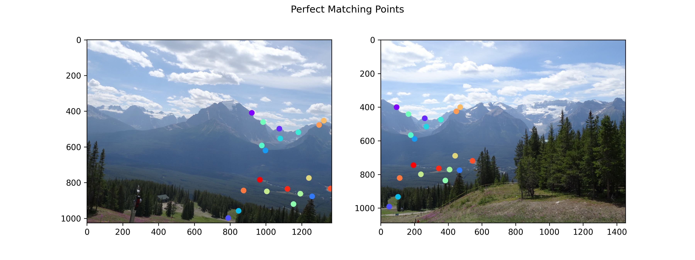
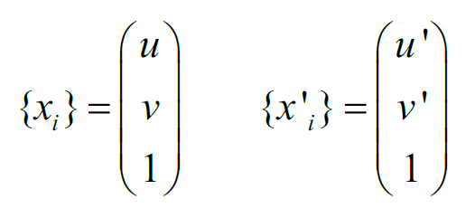
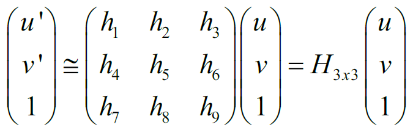
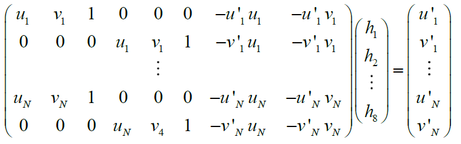
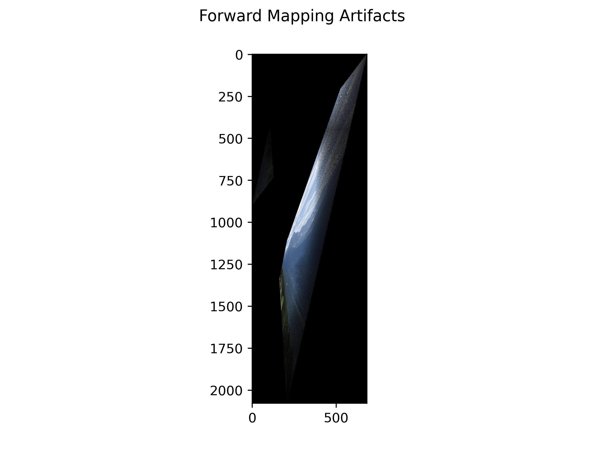
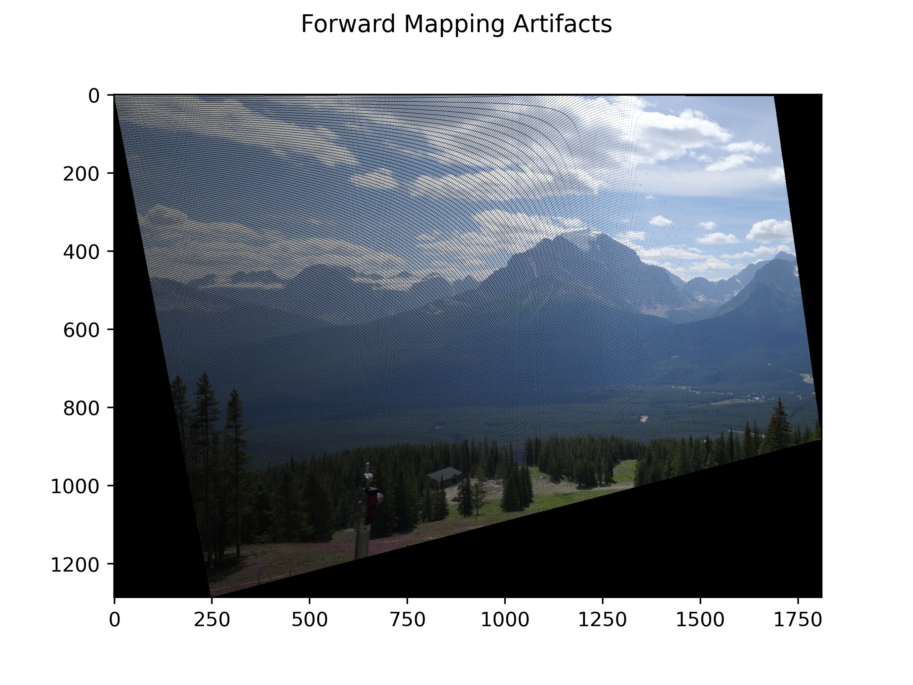
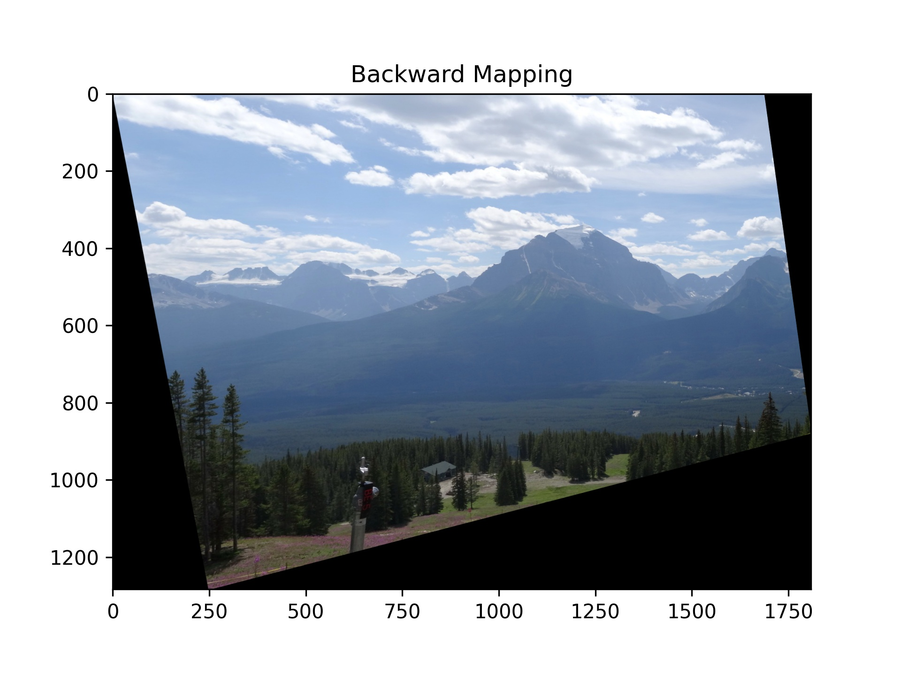
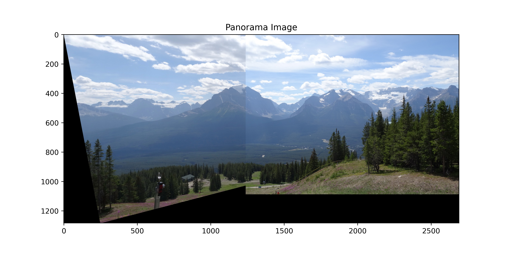
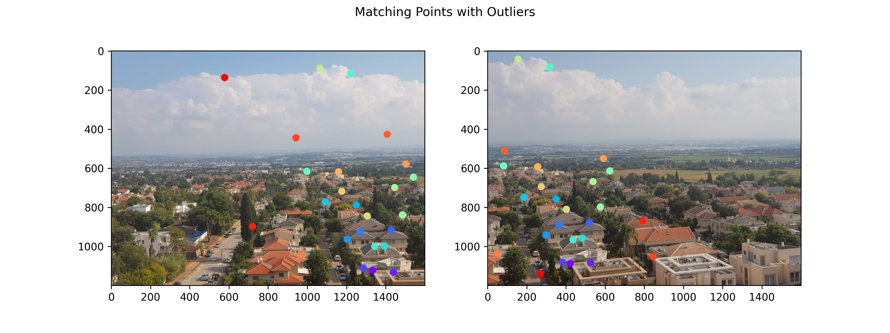
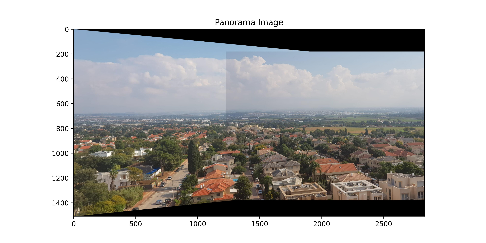

# Image Transformations and Panorama - Overview
Project in *Computer Vision* Course 2020 at **Tel-Aviv University, Israel.**
Overview of my project with my colleague Omri P.

:fire:  Buzzwords : `Computer-Vision`, `Image-transformation`, `Homography`, `Panorama`.
## Project Assignments:

* Estimation of Homography transformation matrix `H` from *matching points* between two images.
* Apply forward and backward mapping transformation.
    * Forward mapping - self implemented
    * Backward mapping - using `cv2.warpPerspective`
* Attach the two images to a single panorama image (using backward mapping)

## Parameters Estimation:
**Input:** Two images and set of matching points between them:

 

We need to find the Homography transformation matrix `H` from the Equation:

 

To find the matrix `H` we need at least 4 matching points. We get the system:

 

More matching points will provide a better estimation for `H` params, but the data may contains outliers.

### Outliers :

The naive estimation using all the matching points will provide the transform:
 

  
  <i>Forward mapping transformation with outliers
</i>

We can see that this transformation is not matched the Homography transformation between the images, because of the outliers in the data.
 
We used RANSAC algorithm to deal with the outliers and get the correct parameters of the transformation.

## Forward Mapping:
Forward mapping *(from src to dst)* :   this mapping may create artifacts in the transformed image:

 

  
  <i>Forward mapping artifacts
</i>

## Backward Mapping:
Backward mapping *(from dst to src values)* :   We can see that we get good result.

 

  
  <i>Backward mapping using cv2.warpPerspective
</i>

## Panorama result:
We Transformed and aligned the images on the same coordinates, we get the panorama image:

 

  
  <i>
</i>

## Test Images:
We took two images and find some matching points between them:
(we also set few outliers in the data)

 

  
  <i>
</i>

We test our implementation on these images, and get the Panorama image:
 
 

  
  <i>
</i>

